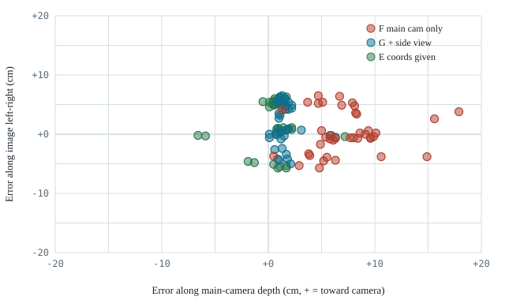

# Where Does a General Multimodal Model Break Down in Robot Manipulation?

**English** | [中文](README_zh.md)

A reproducible probe on the LIBERO simulator that separates what a general-purpose multimodal model can and cannot do when it controls a robot arm. The model under study is GPT-6 (`gpt-6-astra`, called through the Codex CLI); the harness works with any model that takes images and returns structured text.

📄 [Full report](docs/report.md) · 🎬 [All video cases](docs/cases.md) · 🛠 [Reproduce](code/README.md) · 📊 [Raw success counts](results/success_rates.csv)

## Research question

When a multimodal model controls a robot arm, which step limits it: deciding what to do, locating things in space, or producing the motor commands?

We answer three narrower questions, each with a ground-truth baseline that runs the same controller on true object positions (40/40 success), so failures can be attributed to the model rather than the harness.

## Key findings

**1. When object positions are known, can it complete the task?**
On the four pick-and-place tasks tested, yes, reliably. Given true object coordinates, it succeeds 40/40 when choosing grasp/place targets for a fixed controller, and 37/40 when it outputs raw 7-D end-effector actions itself, with no controller in between. The same holds for two other pick-and-place tasks and a knob-press task (29/30). It does **not** hold for opening drawers (0/20) or pushing (5/10), even with coordinates given.

**2. When coordinates are removed, where does it fail?**
At judging depth from a single camera. Outputting raw actions from images alone, it succeeds 2/40. At the first gripper close, it is on average 7.2 cm off along the camera's line of sight (toward the camera), but only 0.3 cm off left-right. Asked to state object positions in metric 3D coordinates, it succeeds 0/40. When it only points at pixels and a depth map converts them to 3D, it succeeds 30/40, because the depth map supplies exactly the missing dimension.

**3. What does adding a camera view fix, and what does it not?**
One extra side-view camera, perpendicular to the main one, raises raw-action success on the four tasks from 2/40 to 34/40 and cuts the depth error from 7.2 cm to 1.6 cm. Raising reasoning effort instead reaches only 3/16. The side view does not fix drawers (0/18), pushing (0/9) or a small stove knob (4/10), and on the strictest placement task it often stops 3–4 cm off target while declaring success.

## One case

Same scene, raw actions from images only. Left: main + wrist camera; the gripper closes on empty space in front of the bowl. Right: plus one side-view image; it grasps the rim and places the bowl on the stove.


Gripper position relative to the object at first close, 40 episodes per condition:



## Capability boundaries (within the tested tasks)

| Ability | Observed | Evidence |
|---|---|---|
| Choosing grasp part and placement from known coordinates | Reliable on 4 pick-place tasks | 40/40 |
| Raw 7-D action control toward known targets (approach, grasp, carry, place, press) | Reliable | 37/40 on 4 tasks; 29/30 on 3 more |
| Pointing at objects in the image | Reliable, except when the image center of an opening differs from its 3D center | 30/40; 1/10 on the bowl-center task |
| Depth from one oblique camera | Fails; biased toward the camera | 2/40, 7.2 cm error |
| Localization with two orthogonal views | Mostly works | 34/40, 1.6 cm error |
| Stating metric 3D coordinates from images | Fails | 0/40 |
| Approaching from the side (drawer handles) | Fails, with or without coordinates | 0/20, 0/18 |
| Non-prehensile pushing | Unreliable | 5/10 with coordinates |
| Anticipating implicit geometry (object offset when held by its rim) | Not without a hint; matters only for tight tolerances | 9/10 → 2/10 |

Scope: LIBERO simulation, 10 libero_goal tasks, 10 episodes per condition per task (4 for the high-effort run), lowest reasoning effort unless stated, one camera layout. No comparison with other models yet. See [limitations](docs/report.md#limitations).

## Reproduce

```bash
cd code
export LIBERO_ROOT=/path/to/LIBERO PY=/path/to/venv/bin/python
source env.sh
bash run_condition.sh act_vision_side 1 10     # condition, task id, episodes
$PY analyze.py act_vision_side
```

Needs a GPU node for MuJoCo EGL rendering and a logged-in Codex CLI. Every condition, its arguments and its expected result are listed in [`code/conditions.tsv`](code/conditions.tsv); setup details are in [`code/README.md`](code/README.md).

## Related work

Galbot's *GPT 6 Astra as an Embodied Policy* reports 49/50 zero-shot on RoboLab pick-and-place with head and dual-wrist cameras. Our single-camera result (2/40) and side-view result (34/40) suggest camera layout is the main reason for the gap; see the [comparison](docs/report.md#comparison-with-related-work).
