# GPT-6 机器人操作能力探针（LIBERO）

GPT-6 能在仿真里操作机械臂。本项目把"操作"拆成几种能力分别测量，找出它的瓶颈在哪一步。

**结论**：规划没问题，控制也没问题，瓶颈是**从单个斜视相机判断远近**。给它物体坐标，它直接输出电机动作，40 回合成功 37 次；只给主相机的图，成功 2 次，夹爪平均落在物体靠相机一侧 7.2 cm 处；再给一张侧视相机的图，成功 34 次。

- 环境：LIBERO 仿真（Franka 机械臂，libero_goal 任务集）
- 模型：`gpt-6-astra`，通过 Codex CLI 调用
- 规模：共 413 个 GPT-6 回合，另有 40 个真值对照回合
- 代码与复现命令：[`code/`](code/README.md)

---

## 1. 测试什么能力

让机械臂"把碗放到盘子上"，需要依次做对三件事：

| 能力 | 含义 | 例子 |
|---|---|---|
| ① 规划 | 先抓什么、放哪、抓哪个部位 | "碗太宽，要夹碗沿，再放到盘子上" |
| ② 图上定位（2D） | 在图像里找到那个位置 | "碗的右沿在图上第 280 列、第 284 行" |
| ③ 空间定位（3D） | 那个位置在真实空间里的米制坐标 | "碗沿在 x=−0.10, y=−0.06, z=0.94 m" |

在这之外还有第四种：④ **底层控制**，即不借助任何控制程序，直接输出每一步电机动作。

要回答的问题：GPT-6 能控制机器人，是因为它有很强的 3D 空间理解，还是因为它是一个很强的规划器？以及，它能不能像 VLA 一样直接输出动作？

## 2. 实验设计

### 任务

| 任务 | 内容 | 成功条件 |
|---|---|---|
| 8 | 把碗放到盘子上 | 严：碗心离盘心 < 3 cm |
| 1 | 把碗放到炉子上 | 松 |
| 4 | 把碗放到柜顶 | 松 |
| 6 | 把奶油芝士放进碗里 | 严 |

第四轮另测了 libero_goal 其余 6 个任务（见 3.4）。每个条件、每个任务 10 回合，成功与否由仿真器判定。

### 第一轮：GPT-6 只说"在哪"，由固定控制程序执行（条件 A–D）

每一步把两张图（固定主相机、腕部相机）和指令发给 GPT-6，它只回复 `抓取(位置)`、`放置(位置)` 或 `完成`，由一段固定的控制程序移动机械臂。每回合最多 6 次调用。**四个条件的唯一区别是 GPT-6 用什么方式表达"位置"：**

| 条件 | GPT-6 输出 | 需要它自己具备 | 程序代劳 |
|---|---|---|---|
| **A** 指像素（有提示） | 图上像素坐标 | ① + ② | 用深度图把像素换成 3D（③） |
| **B** 指像素（无提示） | 同 A | 同 A，还要自己想到两条物理常识 | 同 A |
| **C** 报坐标（给答案） | 米制 3D 坐标，提示词里给出每个物体的真实坐标 | 只需 ① | ② ③ |
| **D** 报坐标（只看图） | 米制 3D 坐标，不给物体坐标 | ① + ② + ③ | 无 |

A 比 B 多的两句提示："碗比夹爪宽，要夹碗沿"；"夹着碗沿时碗心与夹爪有偏移，放置时要补偿"。

读法：C 成功 → 规划没问题；A 成功而 D 失败 → 2D 定位没问题、3D 定位有问题；A 成功而 B 失败 → 缺物理常识。

**真值对照组**：用物体真实位置代替 GPT-6，走同一套控制程序，40/40 成功。因此下面的失败都可以归因于 GPT-6 给的位置或决策。

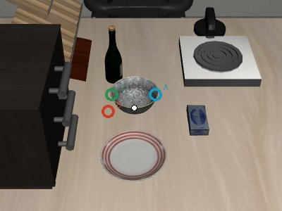

*任务 8 第一步（抓碗）的实际输出。白点为碗心真实位置；蓝 = A 指的像素（碗右沿）；绿 = C 报的坐标（碗左沿）；红 = D 报的坐标（碗外桌面，偏 8 cm）。C 和 D 给出的理由一字不差（"夹碗的左沿，以便提到盘子上"）：D 知道该干什么，只是不知道碗在哪。*

### 第二轮：GPT-6 直接输出机器人动作（条件 E、F）

不使用任何控制程序。每次调用 GPT-6 输出最多 10 步 LIBERO 原生动作 `[dx, dy, dz, 3 个旋转量, 夹爪]`（范围 −1 到 1，与 π₀ 等 VLA 的输出格式相同），原样送进仿真器。执行后把新图、末端位移、末端位置、夹爪开口发回给它。每回合最多 40 次调用、450 步。提示词中写明了实测的控制器响应（满幅每步约 1.3 cm、停下后滑行约 1 cm、夹爪闭合约 10 步）。

| 条件 | GPT-6 能看到 | 测什么 |
|---|---|---|
| **E** 直出动作（给坐标） | 图 + 末端位置 + 物体真实坐标 | 会不会控制 |
| **F** 直出动作（只看图） | 图 + 末端位置 | 视觉定位 + 控制，最接近 VLA |

### 第三轮：定位问题能否靠加视角 / 加推理解决（条件 G、F-high）

在 F 上只改一处：

| 条件 | 改动 |
|---|---|
| **G** | 多给一张侧视相机图。其视线与主相机垂直，主相机的"远近"在这张图里是"左右" |
| **F-high** | 推理档位 low → high，每任务 4 回合 |

### 第四轮：抓放以外的任务

直出动作接口不变，在 libero_goal 其余 6 个任务上跑 E 和 G。

## 3. 结果

### 3.1 第一轮：规划和 2D 定位没问题，3D 坐标不可用

| 任务 | A 指像素·有提示 | B 指像素·无提示 | C 报坐标·给答案 | D 报坐标·只看图 |
|---|:-:|:-:|:-:|:-:|
| 8 碗→盘子（严） | 9/10 | 2/10 | 10/10 | 0/10 |
| 1 碗→炉子（松） | 10/10 | 10/10 | 10/10 | 0/10 |
| 4 碗→柜顶（松） | 10/10 | 10/10 | 10/10 | 0/10 |
| 6 芝士→碗里（严） | 1/10 | 1/10 | 10/10 | 0/10 |
| **合计** | **30/40** | **23/40** | **40/40** | **0/40** |

- **① 规划没问题（C 40/40）**。知道物体在哪时，它能正确分解步骤、选对抓取部位、算对放置点；抓空后能根据"夹爪合拢后是空的"降低高度重抓。
- **② 2D 定位基本没问题（A 在任务 8/1/4 上 9–10/10）**。例外是任务 6（1/10）：它指的是碗口在图上的中心，但相机斜视，这条视线穿过碗口落在碗的远侧内壁，换算出的点比碗心偏远约 3.5 cm，芝士落在碗沿上。它每次重试都指同一个像素，不会往近处挪。**图上的中心 ≠ 空间里的中心**；米制反馈能引导它纠错（C），像素反馈不能（A）。
- **③ 一次性报米制 3D 坐标完全不可用（D 0/40）**。第一次抓取 40 次全部抓空，对碗位置的估计偏 8–25 cm，每次重试给的坐标都在变，结束时物体离目标平均还差 14–27 cm。
- **物理常识不会主动想到**。B 与 A 在宽松任务上无差别，在严格的任务 8 上从 9/10 掉到 2/10：它把夹爪直接对准盘心（平均误差 0.5 cm），没有补偿"夹碗沿导致的碗心偏移 5 cm"。

**视频 1**：任务 8：A 成功 / C 成功 / D 夹爪反复落在碗旁空处，失败

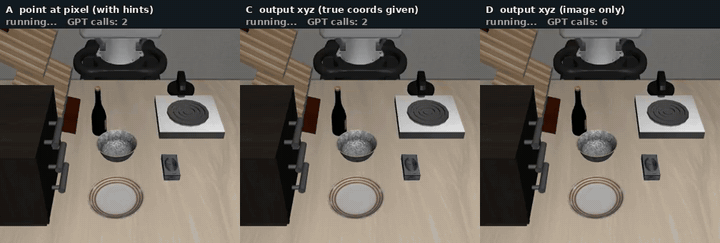

**视频 2**：任务 4：A 成功 / D 失败

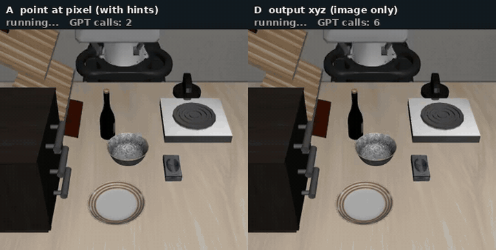

**视频 3**：任务 8：A 放置时补偿偏移，成功 / B 对准盘心放下，碗落在盘边

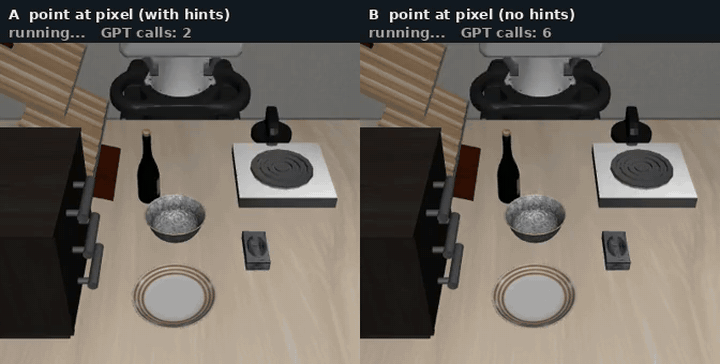

**视频 4**：任务 6：A 芝士落在远侧碗沿 / C 成功 / 真值对照组成功

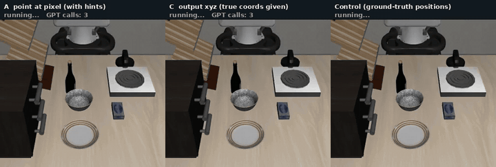

**视频 5**：任务 6：C 抓空后降低高度重抓成功 / A 反复指同一像素失败

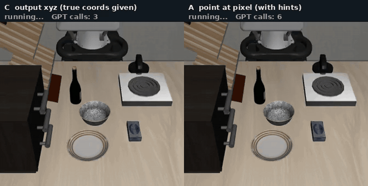

### 3.2 第二轮：GPT-6 会控制，但看不准"远近"

| 任务 | E 直出动作·给坐标 | F 直出动作·只看图 |
|---|:-:|:-:|
| 8 碗→盘子（严） | 7/10 | 0/10 |
| 1 碗→炉子（松） | 10/10 | 0/10 |
| 4 碗→柜顶（松） | 10/10 | 1/10 |
| 6 芝士→碗里（严） | 10/10 | 1/10 |
| **合计** | **37/40** | **2/40** |

- **会控制（E 37/40）**。知道目标位置时，它自己输出的动作能完成接近、减速、对准碗沿、下降、闭合、抬起、搬运、放下，平均 100–130 步，比第一轮固定控制程序（180–225 步）更少。3 次失败都在任务 8：碗放上盘子但偏离盘心 5.5 cm（阈值 3 cm），它认为已完成。
- **只看图时误差有方向（F 2/40）**。大多数回合物体根本没被碰到。下图是每回合第一次闭合夹爪时，夹爪相对物体的水平误差：

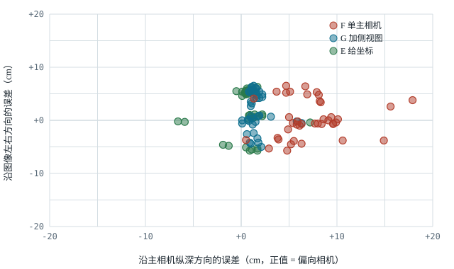

*横轴：沿主相机纵深方向的误差（正 = 偏向相机）；纵轴：沿图像左右方向的误差（cm）。每个条件 40 个点。F 平均偏向相机 7.2 cm，左右方向只偏 0.3 cm；G 纵深误差降到 1.6 cm；E 为 0.6 cm（E 在碗任务上纵轴分成 ±5 cm 两簇，是有意去夹碗的左沿或右沿）。*

它能在图像平面里把夹爪和物体对齐，但分不清夹爪是在物体正上方，还是在物体"前面 7 cm 的半空中"——两者在斜视主相机里几乎一样。它会描述"夹爪在奶油芝士正上方"，实际差了 8 cm。每 10 步看一次新图也纠正不了，因为新图里同样的歧义还在。

这修正了第一轮的结论：不是"3D 定位不行"，而是**单个斜视相机下的纵深判断不行**，左右方向的定位是好的。这也解释了为什么"指像素"能成功：深度图替它解决的正是纵深这一维。

**视频 8**：任务 1：A（固定控制程序）/ E（GPT-6 直出每一步动作），均成功，E 更快

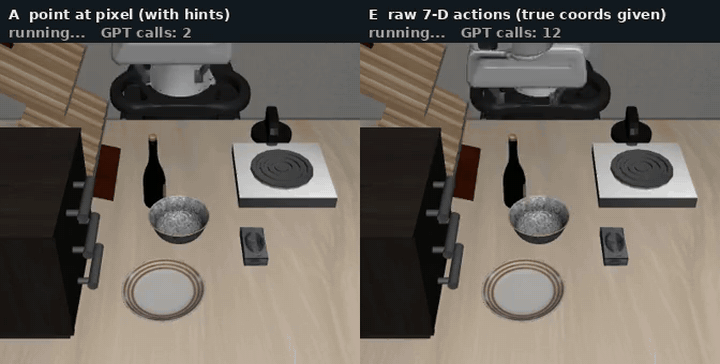

**视频 6**：任务 8：E 成功 / F 夹爪在碗的靠相机一侧反复闭合，碗未被碰到

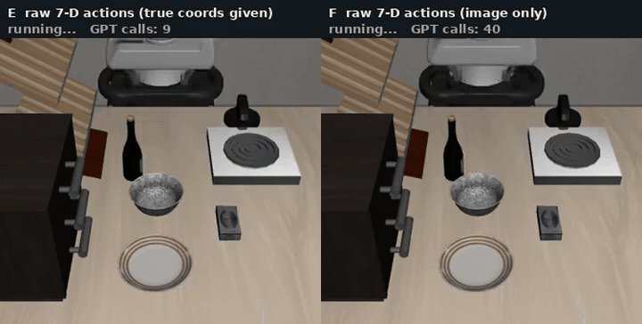

**视频 7**：任务 6：E 成功 / F 夹爪落在芝士靠相机一侧的空处

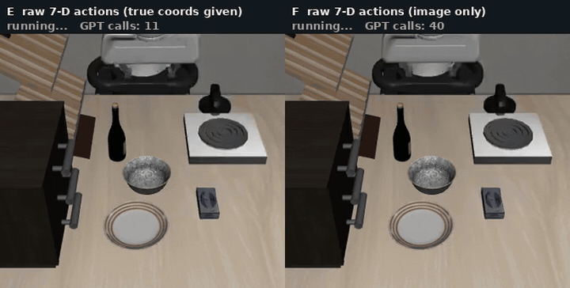

### 3.3 第三轮：加一个正交视角即可解决，加推理作用有限

| 任务 | F 只看图 (low) | F-high 只看图 (high) | G 只看图 + 侧视图 | 参考：E 给坐标 |
|---|:-:|:-:|:-:|:-:|
| 8 碗→盘子（严） | 0/10 | 0/4 | 5/10 | 7/10 |
| 1 碗→炉子（松） | 0/10 | 1/4 | 10/10 | 10/10 |
| 4 碗→柜顶（松） | 1/10 | 0/4 | 10/10 | 10/10 |
| 6 芝士→碗里（严） | 1/10 | 2/4 | 9/10 | 10/10 |
| **合计** | **2/40 (5%)** | **3/16 (19%)** | **34/40 (85%)** | **37/40 (93%)** |

| 首次闭合夹爪时的误差 | 沿主相机纵深 | 沿图像左右 |
|---|:-:|:-:|
| F (low) | 7.2 cm（偏向相机） | 0.3 cm |
| F-high | 3.5 cm | 2.0 cm |
| G（+ 侧视图） | **1.6 cm** | 1.9 cm |
| E（给坐标） | 0.6 cm | 2.0 cm |

- **诊断成立：瓶颈是单目纵深歧义**。加一张正交视角图，成功率 5% → 85%，纵深误差 7.2 → 1.6 cm，接近直接给坐标的 93%。也就是说，GPT-6 只看图、直出电机动作、不给任何坐标或深度，就能完成这四个任务。
- **提高推理档位帮助有限**。high 档 19%，纵深误差减半但仍有 3.5 cm，每次调用的推理 token 从约 80 升到约 210。样本只有 16 回合，只能说远不如加视角有效。
- **剩余失败集中在容差严的任务 8**。G 在任务 8 的 5 次失败中有 4 次是碗放上了盘子、偏离盘心 3.2–4.1 cm（阈值 3 cm）且它宣布完成。与 E 的失败原因相同，属于放置精度和"不核查是否满足条件"的问题，不是定位问题。

**视频 9**：任务 1：F 失败 / G 成功（视频显示主相机画面）

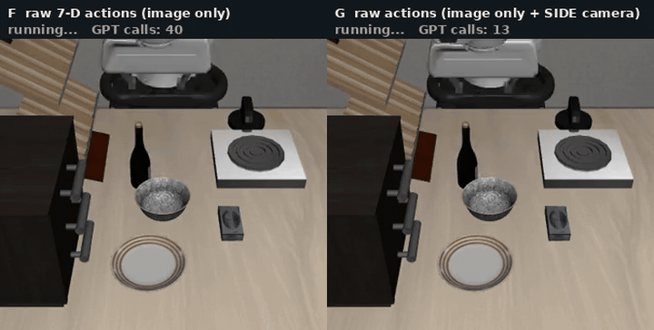

**视频 10**：任务 6：F 失败 / G 成功

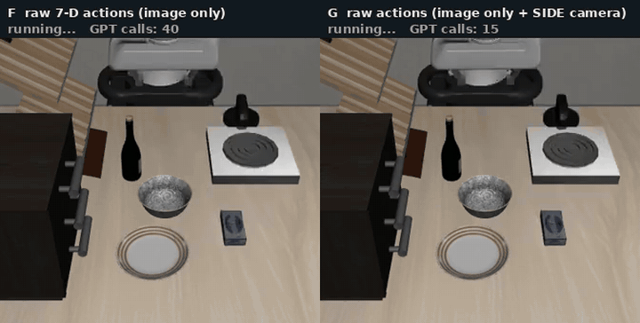

**视频 11**：任务 8，G 的两个回合：成功 / 碗偏离盘心 3.3 cm，它认为已完成

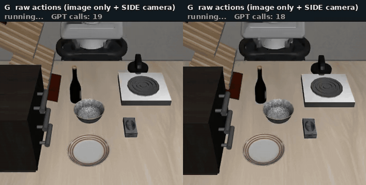

### 3.4 第四轮：抓放以外的任务

| 任务 | 类型 | E 给坐标 | G 只看图 + 侧视图 |
|---|---|:-:|:-:|
| 2 酒瓶→柜顶 | 抓放（细长物体） | 10/10 | 8/10 |
| 9 酒瓶→架子 | 抓放（细长物体） | 9/10 | 7/10 |
| 7 开炉子 | 按压小旋钮 | 10/10 | 4/10 |
| 5 推盘子到炉子前 | 非抓取的推 | 5/10 | 0/9 |
| 0 开中间抽屉 | 铰接物体 | 0/10 | 0/9 |
| 3 开顶层抽屉并放入碗 | 铰接物体，两阶段 | 0/10 | 0/9 |
| **libero_goal 全部 10 个任务** | | **71/100** | **53/97** |

- **控制能力可推广到其他抓放和按压**：酒瓶两个任务和开炉子，给坐标时 29/30；酒瓶任务只需 8–9 次调用、70–85 步。
- **开抽屉完全不行，且不是定位问题**：给不给坐标都是 0。夹爪始终竖直朝下，反复从柜子上方下降、被柜体挡住、抬起、换位置再降，从未碰到把手，抽屉位置在所有回合中都没变。抓柜子正面的把手需要从侧面接近或转动手腕，它没有这样做（提示词中"除非需要否则旋转量保持 0"可能也抑制了这一点）。
- **推（非抓取）不稳**：给坐标也只有 5/10，失败时盘子被推动但没到目标区域。
- **只看图时目标越小越难**：开炉子 10/10 → 4/10，需要碰到一个很小的旋钮。

**视频 14**：任务 2（酒瓶放柜顶）：E、G 均成功

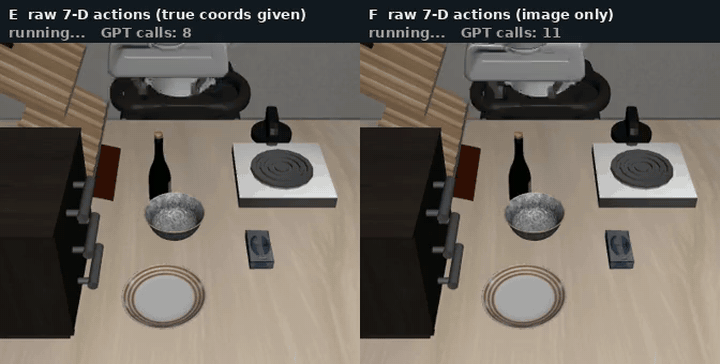

**视频 12**：任务 7（开炉子）：E 成功 / G 成功 / G 失败，夹爪落在旋钮旁

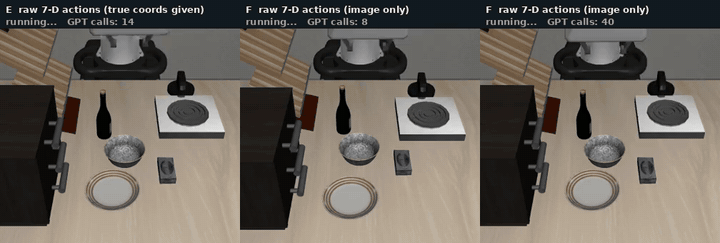

**视频 13**：任务 0（开抽屉）：E、G 均失败，始终没碰到把手

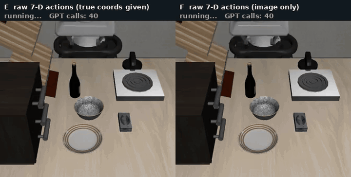

**视频 15**：任务 5（推盘子），均为 E：成功 / 盘子被推动但未到目标

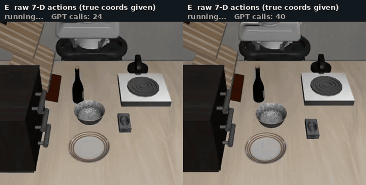

### 3.5 能力边界汇总

| 能力 | 结果 | 依据 |
|---|---|---|
| 规划（任务分解、抓取部位） | 会 | C 40/40 |
| 2D 图上指点 | 会；斜视下"图上中心"与"空间中心"会混淆 | A 30/40；任务 6 A 1/10 |
| 一次性报米制 3D 坐标 | 不会 | D 0/40 |
| 单目纵深判断 | 不会，平均偏向相机 7.2 cm | F 2/40 |
| 双视角定位 | 基本会 | G 34/40 |
| 底层控制（自由空间接近、抓取、搬运、放置、按压） | 会 | E 37/40；其他抓放/按压 29/30 |
| 需规划接近方向的操作（抽屉把手） | 不会 | E、G 均 0 |
| 持续接触控制（推） | 一半 | E 5/10 |
| 隐含物理几何（夹碗沿后碗心偏移） | 不会主动想到，仅在严格任务上致命 | 任务 8：A 9/10 → B 2/10 |
| 可见推理链 | 拿不到，只有一两行小标题 | high 档 + detailed summary 实测 |

## 4. 与相关工作的对比

### 银河通用《GPT 6 Astra as an Embodied Policy》

他们同样经 Codex 调用 GPT-6 Astra（xhigh 档，允许读文件、跑代码、记笔记），输入头部和双腕相机 RGB、关节与末端状态、指令、历史，不给物体真值坐标。Direct 模式输出双臂末端目标位姿，每次执行 1–5 步，经逆运动学执行；Hybrid 模式由 π0.5 出 50 步候选动作，GPT-6 选择沿用前 1–15 步或自己给 1–5 步修正。

**他们报告的结果**

| 结论 | 数字 |
|---|---|
| Direct 零样本能完成操作，语义抓放任务上接近全成功 | RoboLab（单臂）49/50；RoboDojo（双臂长程）26% |
| 长程双臂任务上 Hybrid > Direct > π0.5 单独 | 48% / 26% / 15.67%；GPT 只改 14.4% 的控制步；token 少 44.8% |
| 下层 VLA 未在该任务微调时，Hybrid 反而略差 | RoboLab：Direct 98%，Hybrid 92%，π0.5 36% |
| 失败模式：反复抓取失败、容器边缘碰撞、难以把本体状态转成可达的末端目标等 | 定性，无比例统计 |
| 未做归因："各因素分别贡献多少，仍需要进一步分解" | — |

**本项目补充的**

| 发现 | 依据 |
|---|---|
| 把能力拆成规划 / 2D 定位 / 3D 定位 / 控制分别测量，并用真值对照组排除控制程序的影响 | C 40/40、A 30/40、D 0/40、E 37/40、F 2/40、对照组 40/40 |
| 知道目标位置时直出 7 维动作 37/40，步数少于手写控制程序 | 条件 E |
| 视觉定位误差有方向：沿相机纵深平均偏 7.2 cm，左右无偏；加正交视角即可解决（5% → 85%），提高推理档位作用有限（19%） | 条件 F、G、F-high |
| 一次性报米制坐标完全不可用 | 条件 D 0/40 |
| 图上的中心 ≠ 空间里的中心；米制反馈能引导纠错，像素反馈不能 | 任务 6：A 1/10，C 10/10 |
| 隐含物理几何不会主动想到 | 任务 8：A 9/10 → B 2/10 |
| 开抽屉失败与定位无关，与他们报告的"容器边缘碰撞""难以转成可达末端目标"是同一类失败 | 任务 0、3：E、G 均 0 |

**表面矛盾的解释**：他们的 Direct 只看图在 RoboLab 抓放上 49/50，本项目最接近的条件 F 只有 2/40。两边都是闭环、只看图、不给坐标，剩下四个差异：推理档位（xhigh vs low）、相机（头部 + 两个腕部 vs 一个斜视主相机 + 一个腕部）、是否允许跑代码和记笔记、每段步数（1–5 vs 10）。第三轮检验了其中两个：加一个正交视角 5% → 85%，提高推理档位只到 19%，因此**相机布置是主要因素**。代码能力和每段步数尚未单独测。

### FluxVLA issue #121

第一轮的结论（GPT-6 完成操作靠的是规划和 2D 图像理解，给不出可用的米制 3D 坐标）与该 issue 报告的现象一致。本项目在 4 个任务、40 个回合上定量复现了它（条件 D 0/40），并进一步把问题定位到纵深这一维。

## 5. 局限

- 每个条件每个任务只有 10 回合。0/40 对 40/40 的差距可靠；A、B 中单格数字波动较大（任务 8 条件 B 在调整控制程序前后分别为 6/10 和 2/10），不宜对单格小差异下结论。
- 第一轮（A–D）只测了 4 个抓放任务；其余 6 个任务只在直出动作接口下测过。
- 开抽屉任务中，条件 E 给的是抽屉本体中心而非把手的坐标（仿真器中把手没有单独命名），所以这两个任务上的 E 不是严格意义的"给了目标位置"。
- GPT-6 通过 Codex 调用，每次调用自带 Codex 的系统提示，与直接调 API 的裸模型不完全等同。
- 除 F-high 外全部使用最低推理档位；F-high 每任务只有 4 回合。
- F 的纵深误差数值依赖于这一个斜视主相机的布置。
- 没有与上一代 GPT 或开源模型对比，不能说这些能力是 GPT-6 新出现的。

## 仓库内容

```
README.md                      本报告
code/                          实验代码，复现方法见 code/README.md
results/success_rates.csv      全部条件 × 任务的成功次数
assets/task8_grasp_points.jpg  任务 8 三个条件的抓取点对比
assets/first_grasp_error.svg   首次闭合夹爪时的误差散点图
assets/gifs/video01-15.gif     对照动图（3 倍速，画面顶部标注条件与结果）
```
